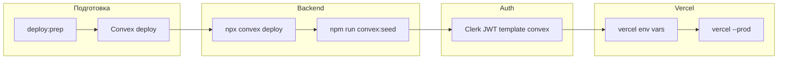

# FundingPro

AI-платформа для поиска международных грантов, проверки соответствия требованиям и подготовки заявок.

**Компания:** ООО «FUNDINGPRO» / "FUNDINGPRO" MCHJ (STIR: 313 116 567)
**Регистрация ПО:** DGU No. 61712 (27.03.2026, заявка DT 202602875)
**Регистрация юрлица:** 18.06.2026, подтверждение № 3174142
**Основатель:** Shayxislam Seytibaev
**GitHub:** [Shayxislam23/FundingPro](https://github.com/Shayxislam23/FundingPro)

---

## Стек

| Слой | Технология |
|------|------------|
| Frontend + Backend | Next.js 14 App Router |
| UI | React 18 + Tailwind CSS + Radix UI |
| БД + API | [Convex](https://convex.dev) (реактивная document-relational БД) |
| Auth | [Clerk](https://clerk.com) (Email OTP, JWT → Convex) |
| Email | Resend (info@fundingpro.uz) |
| Язык | TypeScript |
| Деплой | Vercel (web) + Convex Cloud (backend) |

---

## Быстрый старт

### 1. Клонировать и установить зависимости

```bash
git clone https://github.com/Shayxislam23/FundingPro.git
cd FundingPro
npm install
cd fundingpro
```

### 2. Переменные окружения

```bash
cp .env.example .env.local
# Заполни Clerk и Convex ключи (см. ниже)
```

### 3. Convex + Clerk

В двух терминалах:

```bash
# Терминал 1 — Convex backend (создаёт dev deployment, пишет NEXT_PUBLIC_CONVEX_URL)
npx convex dev

# Терминал 2 — Next.js
npm run dev
```

**Первый запуск каталога (доноры, гранты, тарифы):**

```bash
npm run convex:seed
```

**Авторизация:** Clerk Email OTP (6-значный код на email). Настройте Clerk Dashboard → JWT template `convex` для интеграции с Convex.

### 4. Запуск

```bash
npm run dev
# http://localhost:3000
```

---

## Environment Variables

### Обязательные

```env
# Convex — заполняется `npx convex dev` или Convex Dashboard
NEXT_PUBLIC_CONVEX_URL=https://your-deployment.convex.cloud
CONVEX_DEPLOYMENT=dev:your-deployment

# Clerk — dashboard.clerk.com → API Keys
NEXT_PUBLIC_CLERK_PUBLISHABLE_KEY=pk_test_...
CLERK_SECRET_KEY=sk_test_...
CLERK_JWT_ISSUER_DOMAIN=https://your-clerk-domain.clerk.accounts.dev

# Email
RESEND_API_KEY=re_...
RESEND_FROM_EMAIL=info@fundingpro.uz

# Admin
ADMIN_EMAILS=admin@fundingpro.uz
```

### Опциональные

```env
# AI (если не указаны — используется MockProvider)
OPENAI_API_KEY=sk-...
ANTHROPIC_API_KEY=sk-ant-...
AI_PROVIDER=mock   # openai | anthropic | mock

# Платежи Uzum Bank (выключены до sandbox-тестов)
PAYMENTS_ENABLED=false
PAYMENT_PROVIDER=uzum
PAYMENT_INTEGRATION_STATUS=pending_integration
```

Полный шаблон: [`.env.example`](.env.example) и [`.env.production.example`](.env.production.example).

---

## Настройка Clerk + Convex

1. Создай приложение на [clerk.com](https://clerk.com)
2. **JWT Templates** → создай шаблон `convex` (см. [Convex Clerk guide](https://docs.convex.dev/auth/clerk))
3. Скопируй `CLERK_JWT_ISSUER_DOMAIN` из Clerk → Convex integration
4. В Convex Dashboard → Settings → Environment Variables → добавь `CLERK_JWT_ISSUER_DOMAIN`
5. Запусти `npx convex dev` и `npm run convex:seed`

---

## Настройка Resend

1. Зарегистрируйся на [resend.com](https://resend.com)
2. **Domains** → добавь и верифицируй `fundingpro.uz`
3. **API Keys** → создай ключ → вставь в `RESEND_API_KEY`

---

## Деплой на Vercel + Convex

### Подготовка

```bash
cp .env.production.example .env.production.local  # шаблон (без секретов в git)
npm run deploy:prep   # typecheck + tests + lint + deploy:check
```



### Пошаговый чеклист

| # | Шаг | Команда / действие |
|---|-----|-------------------|
| 1 | Проверка перед деплоем | `npm run deploy:prep` |
| 2 | Convex production | `npx convex deploy` |
| 3 | Seed каталога | `npm run convex:seed` (на prod deployment) |
| 4 | Clerk | JWT template `convex`, live keys в Vercel |
| 5 | Деплой | `vercel --prod` или push в `main` |

**Автоматизация (после заполнения ключей):**

```bash
node scripts/setup-production-env.mjs   # шаблон .env.production.local
npm run deploy:production               # env → Vercel, seed, vercel --prod
```

**Важные настройки в Vercel Dashboard → Environment Variables:**

| Переменная | Обязательно |
|-----------|-------------|
| `NEXT_PUBLIC_CONVEX_URL` | ✅ |
| `NEXT_PUBLIC_CLERK_PUBLISHABLE_KEY` | ✅ |
| `CLERK_SECRET_KEY` | ✅ |
| `CLERK_JWT_ISSUER_DOMAIN` | ✅ |
| `RESEND_API_KEY` | ✅ |
| `RESEND_FROM_EMAIL` | ✅ |
| `ADMIN_EMAILS` | ✅ |
| `CONVEX_DEPLOY_KEY` | ✅ (CI / deploy scripts) |
| `AI_PROVIDER` | mock / openai / anthropic |
| `PAYMENTS_ENABLED` | false |

> ⚠️ Не храните секреты в `vercel.json` — только в Environment Variables панели Vercel.

**Build Command:** `npm run build`

---

## Команды

| Команда | Описание |
|---------|----------|
| `npm run dev` | Next.js dev server |
| `npx convex dev` | Convex backend (watch mode) |
| `npm run convex:seed` | Seed каталога (доноры, гранты, тарифы) |
| `npm run setup` | Alias для `npx convex dev` |
| `npm test` | Unit-тесты |
| `npm run test:smoke` | Smoke-тесты API (нужен `npm run dev`) |
| `npm run deploy:check` | Проверка env перед деплоем |
| `npm run deploy:prep` | typecheck + tests + lint + deploy:check |
| `npm run lint` | ESLint |
| `npm run typecheck` | TypeScript |

**Миграция данных из legacy Postgres (одноразово):**

```bash
npm run convex:export-pg   # экспорт PG → data/pg-export.json
npm run convex:import-pg   # импорт в Convex
```

---

## Платёжная интеграция (Uzum Bank)

> По умолчанию **`PAYMENTS_ENABLED=false`** — включайте только после sandbox-тестов с реальными credentials от Uzum.

| Канал | Назначение | API |
|-------|------------|-----|
| **Merchant API** | Оплата из приложения Uzum Bank | Inbound webhooks: `/check`, `/create`, `/confirm`, `/reverse`, `/status` |
| **Checkout API** | Оплата картой на сайте | Outbound: `payment.register` + return URL |

### Локальное тестирование

```bash
npm test                    # unit-тесты payments + uzum-merchant
PAYMENTS_ENABLED=true npm run dev   # отдельный терминал
npx convex dev                      # Convex backend
npm run uzum:sandbox        # Merchant E2E (check → create → confirm)
npm run uzum:checkout-mock  # Checkout mock E2E (без Uzum API)
```

E2E-скрипты используют Convex internal functions (`convex/e2eTest.ts`), не Postgres.

### Go-live команды

```bash
npm run uzum:check      # чеклист готовности
npm run uzum:webhooks   # URL для регистрации в кабинете Uzum
npm run uzum:sandbox    # E2E Merchant flow
npm run uzum:checkout-mock
npm run uzum:enable     # включить PAYMENTS_ENABLED после проверок
```

**Пилот 5–10 paying orgs:** см. [docs/POST_UZUM_PILOT.md](docs/POST_UZUM_PILOT.md) и `npm run pilot:check`.

### Безопасность

- `requireActiveUserOrResponse` — проверка `is_active` / `is_banned` на защищённых API routes
- Plan limits в API: Basic 5 eligibility / 2 AI drafts в месяц (`lib/plan-limits.ts`)
- Admin access: `ADMIN_EMAILS` + Convex `platformRole` (`lib/auth/admin-access.ts`)

### Админка

`/admin/payments` — отчёт по платежам с полем `provider=uzum` и `provider_ref_id`.

---

## Юридическое соответствие (РУз)

Публичные документы (RU + UZ) в [`lib/legal/`](lib/legal/) и на страницах `/legal/*`.

API: `GET /api/v1/legal`, `POST /api/v1/legal/consent`, `GET /api/v1/legal/consent/status`.

---

## Growth, SEO и SMM

- Публичный каталог грантов: `/grants`, `/grants/[id]`
- SEO: `sitemap.xml`, `robots.txt`, Open Graph
- Подробнее: [docs/GROWTH_PLAYBOOK.md](docs/GROWTH_PLAYBOOK.md)

---

## President Tech Award / President AI Award 2026

Стратегия и подготовка к обеим госпрограммам на awards.gov.uz:
[docs/AWARDS_STRATEGY_2026.md](docs/AWARDS_STRATEGY_2026.md) ·
[docs/JUDGE_EVIDENCE_PACKET.md](docs/JUDGE_EVIDENCE_PACKET.md) ·
[docs/AWARDS_SUBMISSION_PLAYBOOK.md](docs/AWARDS_SUBMISSION_PLAYBOOK.md)

---

## Дисклеймер

FundingPro не гарантирует получение гранта. Платформа помогает найти подходящие возможности, проверить требования и подготовить заявку.

FundingPro не является микрофинансовой организацией, банком, кредитной или платёжной организацией.
