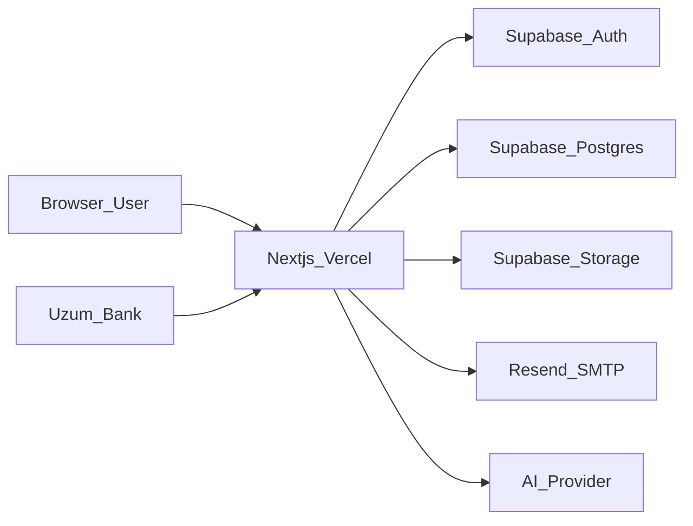

# FundingPro — Threat Model (STRIDE)

Generated as part of the 817-skills security audit.

## System boundary

## Assets

| Asset | Location | Sensitivity |
|-------|----------|-------------|
| User PII (email, org) | `users`, `organizations` | High |
| Grant applications | `applications`, `documents` | High |
| Payment records | `payments`, `uzum_transactions` | High |
| Admin audit trail | `audit_logs`, `ai_requests` | Medium |
| Public catalog | `grants`, `donors`, `plans` | Low |

## Trust zones

1. **Public** — landing, grants catalog, health, plans (intended public)
2. **Authenticated user** — dashboard, applications, documents, AI writer
3. **Admin** — `/admin/*`, admin API (`withAdmin`)
4. **Merchant** — Uzum webhook routes (Basic auth)
5. **Server-only** — service role key, DATABASE_URL, Resend API key

## STRIDE analysis

### Spoofing

| Threat | Mitigation | Gap |
|--------|------------|-----|
| Fake JWT | Supabase JWT verification via `getSupabaseUser` | Service role fallback in dev |
| Uzum impersonation | Basic auth on merchant routes | Timing-safe compare added |
| Admin spoof | `ADMIN_EMAILS` + `platform_role` | `ADMIN_BYPASS_DEV` in dev only |

### Tampering

| Threat | Mitigation | Gap |
|--------|------------|-----|
| BOLA on applications/documents | `userId` checks + RLS policies | App uses admin client server-side |
| Mass assignment | Explicit field allowlists in PATCH handlers | Review new routes |
| SQL injection | Parameterized `pg` queries | Static scan clean |

### Repudiation

| Threat | Mitigation | Gap |
|--------|------------|-----|
| Deny user actions | `audit_logs`, `ai_requests` | Writes are warn-only on failure |

### Information disclosure

| Threat | Mitigation | Gap |
|--------|------------|-----|
| Anon PostgREST read | RLS hardening migration applied | Requires service role in prod |
| Health endpoint leak | `dbError` hidden in production | Verified by probe |
| AI prompt PII | `sanitizeForAI`, redaction in gateway | Provider still receives redacted text |

### Denial of service

| Threat | Mitigation | Gap |
|--------|------------|-----|
| AI abuse | `rate_limit_buckets` + plan limits | In-memory fallback on serverless |
| Lead magnet spam | IP rate limit on public route | No global WAF |

### Elevation of privilege

| Threat | Mitigation | Gap |
|--------|------------|-----|
| User → admin | `requireAdmin`, middleware admin check | Edge uses anon key if no service role |
| User → other user's data | BOLA checks in DB layer | 12 custom-auth API routes need audit |

## Priority controls

1. Set `SUPABASE_SERVICE_ROLE_KEY` in Vercel production
2. Enable Supabase Auth SMTP (Resend) + leaked password protection
3. Keep RLS policies synced via `supabase db push`
4. Security headers via `next.config.mjs` (implemented)
5. CI: `npm run security:audit` on every push
