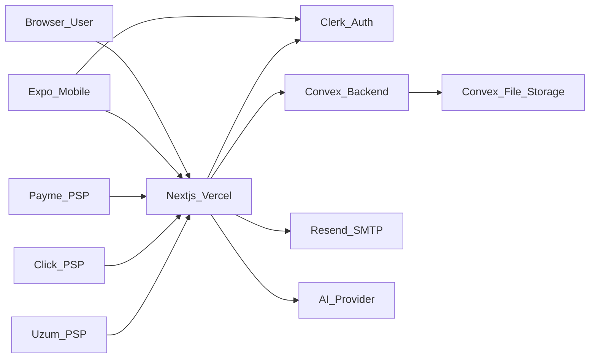

# FundingPro — Threat Model (STRIDE)

Generated as part of the 817-skills security audit. Updated for **Convex + Clerk** architecture (July 2026).

## System boundary

## Assets

| Asset | Location | Sensitivity |
|-------|----------|-------------|
| User PII (email, org) | Convex `users`, `organizations` | High |
| Grant applications | Convex `applications`, `documents` | High |
| Lab cohort / mentor data | Convex `lab*` tables | High |
| Payment records | Convex `payments`, PSP transaction tables | High |
| Admin audit trail | Convex `auditLogs`, `aiRequests` | Medium |
| Public catalog | Convex `grants`, `donors`, `plans` | Low |
| Platform settings | Convex `settings` | Medium (admin/internal only) |

## Trust zones

1. **Public** — landing, grants catalog, health, plans, legal pages
2. **Authenticated user** — dashboard, applications, documents, AI writer, Lab
3. **Admin** — `/admin/*`, admin API (`withAdmin`), Convex `adminQuery` / `adminMutation`
4. **Merchant / PSP** — Payme, Click, Uzum callback routes (provider-specific auth)
5. **Server-only** — `CONVEX_DEPLOY_KEY`, `CONVEX_SYSTEM_SECRET`, Clerk secret, Resend API key, AI keys

## STRIDE analysis

### Spoofing

| Threat | Mitigation | Gap |
|--------|------------|-----|
| Fake session / JWT | Clerk session + Convex JWT via `ctx.auth.getUserIdentity()` | Dev-only bypass flags must stay off in prod |
| PSP impersonation | Provider-specific merchant auth on callback routes | Sandbox credentials required for E2E |
| Admin spoof | `platformRole === "admin"` + `withAdmin` on API routes | Review new admin routes in CI matrix |

### Tampering

| Threat | Mitigation | Gap |
|--------|------------|-----|
| BOLA on applications/documents/Lab | Ownership checks in Convex functions + API wrappers | Audit new Lab routes |
| Mass assignment | Explicit field allowlists in PATCH handlers | Review new routes |
| Client writes to protected tables | No direct DB access; all writes via Convex mutations | Custom functions enforce auth |

### Repudiation

| Threat | Mitigation | Gap |
|--------|------------|-----|
| Deny user actions | Convex `auditLogs`, `aiRequests`, payment events | Writes are warn-only on failure |

### Information disclosure

| Threat | Mitigation | Gap |
|--------|------------|-----|
| Unauthenticated settings read | `settings.getByKey` admin-only; server reads via internal query | Public keys use allowlisted `getPublicByKey` only |
| Health endpoint leak | `buildHealthPayload` omits internal errors in production | Verified by probe |
| AI prompt PII | `sanitizeForAI`, redaction in gateway | Provider still receives redacted text |
| Payment system actions | `paymentsSystem.*` requires `CONVEX_SYSTEM_SECRET` | Secret rotation is ops |

### Denial of service

| Threat | Mitigation | Gap |
|--------|------------|-----|
| AI abuse | Convex `rateLimitBuckets` + plan limits; edge rate limits | Prod denies when Convex unavailable |
| Lead magnet spam | IP rate limit on public route | No global WAF |
| Unbounded queries | Indexed queries + `.collect()` CI gate | Review new hot paths |

### Elevation of privilege

| Threat | Mitigation | Gap |
|--------|------------|-----|
| User → admin | `requireAdmin`, middleware admin check | Keep admin list in Clerk + Convex sync |
| User → other user's data | BOLA checks in Convex + `withActiveUser` | Periodic API matrix review |
| Client → internal Convex | Internal functions not exposed to clients; deploy key server-only | Never expose `CONVEX_DEPLOY_KEY` to browser |

## Priority controls

1. Set production env: `NEXT_PUBLIC_CONVEX_URL`, `CONVEX_DEPLOY_KEY`, `CONVEX_SYSTEM_SECRET`, Clerk keys
2. Keep `settings` reads admin-only or allowlisted public keys; server-side reads via internal query
3. Security headers via `next.config.mjs` (CSP, HSTS)
4. Edge rate limits on AI, auth, payments, webhooks (middleware)
5. CI: `npm run security:audit`, `node scripts/convex-collect-audit.mjs` on every push
6. Ops before launch: App Links live check, PSP sandbox E2E — see [`OPS-RUNBOOK.md`](../OPS-RUNBOOK.md)
